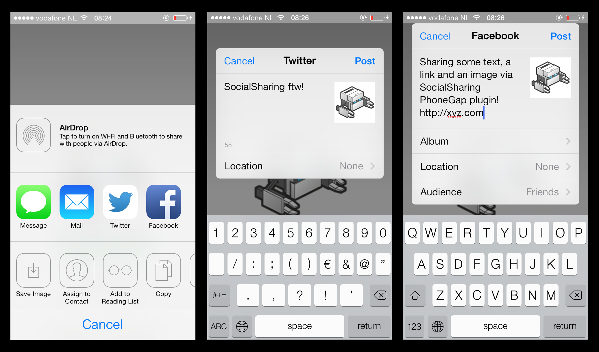
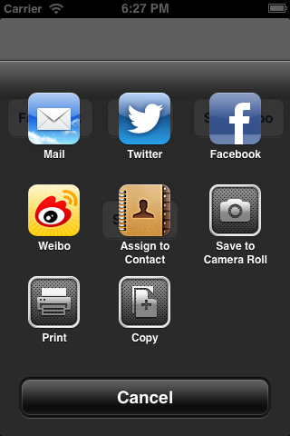
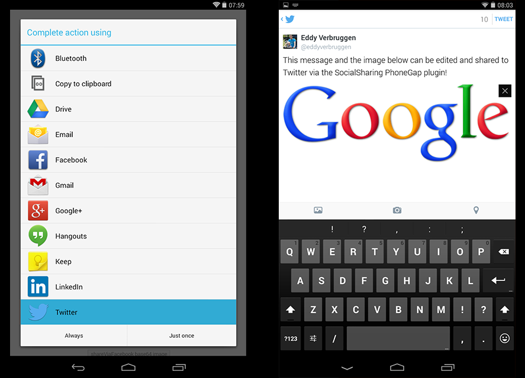
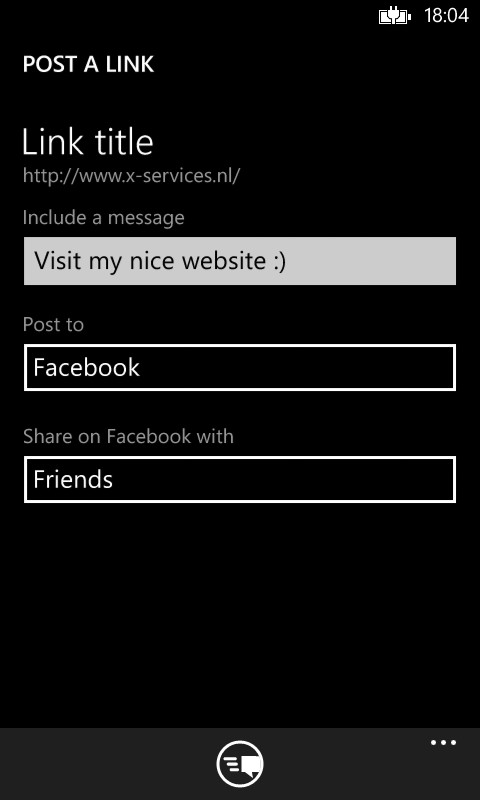

# PhoneGap Social Sharing plugin for Android, iOS and Windows Phone

by Eddy Verbruggen, [read my blog about this plugin](http://www.x-services.nl/phonegap-share-plugin-facebook-twitter-social-media/754)

* These instructions are for PhoneGap 3.0.0 and up.
* For Phonegap 2.9.0 and lower, see [the 2.x branch](https://github.com/EddyVerbruggen/SocialSharing-PhoneGap-Plugin/tree/phonegap-2.x/).

## 0. Index

1. [Description](#1-description)
2. [Screenshots](#2-screenshots)
3. [Installation](#3-installation)
	3. [Automatically (CLI / Plugman)](#automatically-cli--plugman)
	3. [Manually](#manually)
	3. [PhoneGap Build](#phonegap-build)
4. Usage
  4. [iOS and Android](#4a-usage-on-ios-and-android)
  4. [Windows Phone](#4a-usage-on-windows-phone)
5. [Credits](#5-credits)
6. [License](#6-license)

## 1. Description

This plugin allows you to use the native sharing window of your mobile device.

* Works on Android, version 2.3.3 and higher (probably 2.2 as well).
* Works on iOS6 and iOS7.
* Works on Windows Phone 8 (maybe even 7, but I have no such testdevice).
* Share text, a link, an image (or other files like pdf or ics). Subject is also supported, when the receiving app supports it.
* Supports sharing files from the internet, the local filesystem, or from the www folder.
* You can skip the sharing dialog and directly share to Twitter, Facebook, or other apps.
* Compatible with [Cordova Plugman](https://github.com/apache/cordova-plugman).
* Officially supported by [PhoneGap Build](https://build.phonegap.com/plugins).

## 2. Screenshots
Sharing options are based on what has been setup in the device settings.

iOS 7



iOS 6



Android



Windows Phone 8



## 3. Installation

### Automatically (CLI / Plugman)
SocialSharing is compatible with [Cordova Plugman](https://github.com/apache/cordova-plugman), compatible with [PhoneGap 3.0 CLI](http://docs.phonegap.com/en/3.0.0/guide_cli_index.md.html#The%20Command-line%20Interface_add_features), here's how it works with the CLI:

```
$ phonegap local plugin add https://github.com/EddyVerbruggen/SocialSharing-PhoneGap-Plugin.git
```
or
```
$ cordova plugin add https://github.com/EddyVerbruggen/SocialSharing-PhoneGap-Plugin.git
```
run this command afterwards (backup your project first!):
```
$ cordova prepare
```

SocialSharing.js is brought in automatically. There is no need to change or add anything in your html.

### Manually

1\. Add the following xml to your `config.xml` in the root directory of your `www` folder:
```xml
<!-- for iOS -->
<feature name="SocialSharing">
  <param name="ios-package" value="SocialSharing" />
</feature>
```
```xml
<!-- for Android -->
<feature name="SocialSharing">
  <param name="android-package" value="nl.xservices.plugins.SocialSharing" />
</feature>
```
```xml
<!-- for Windows Phone -->
<feature name="SocialSharing">
  <param name="wp-package" value="SocialSharing"/>
</feature>
```

For sharing remote images (or other files) on Android, the file needs to be stored locally first, so add this permission to `AndroidManifest.xml`:
```xml
<uses-permission android:name="android.permission.WRITE_EXTERNAL_STORAGE" />
```

For iOS, you'll need to add the `Social.framework` and `MessageUI.framework` to your project. Click your project, Build Phases, Link Binary With Libraries, search for and add `Social.framework` and `MessageUI.framework`.

2\. Grab a copy of SocialSharing.js, add it to your project and reference it in `index.html`:
```html
<script type="text/javascript" src="js/SocialSharing.js"></script>
```

3\. Download the source files for iOS and/or Android and copy them to your project.

iOS: Copy `SocialSharing.h` and `SocialSharing.m` to `platforms/ios/<ProjectName>/Plugins`

Android: Copy `SocialSharing.java` to `platforms/android/src/nl/xservices/plugins` (create the folders)

Window Phone: Copy `SocialSharing.cs` to `platforms/wp8/Plugins/nl.x-services.plugins.socialsharing` (create the folders)

### PhoneGap Build

SocialSharing works with PhoneGap build too! Version 3.0 and up of this plugin are compatible with PhoneGap 3.0.0 and up.
Use an older version of this plugin if you target PhoneGap < 3.0.0.

Just add the following xml to your `config.xml` to always use the latest version of this plugin:
```xml
<gap:plugin name="nl.x-services.plugins.socialsharing" />
```
or to use an exact version:
```xml
<gap:plugin name="nl.x-services.plugins.socialsharing" version="4.0" />
```

SocialSharing.js is brought in automatically. There is no need to change or add anything in your html.

## 4a. Usage on iOS and Android
You can share text, a subject (in case the user selects the email application), (any type and location of) file (like an image), and a link.
However, what exactly gets shared, depends on the application the user chooses to complete the action. A few examples:
- Mail: message, subject, file.
- Twitter: message, image (other filetypes are not supported), link (which is automatically shortened).
- Google+ / Hangouts: message, subject, link
- Facebook iOS: message, image (other filetypes are not supported), link.
- Facebook Android: sharing a message is not possible. Sharing links and images is, but a description can not be prefilled.

Here are some examples you can copy-paste to test the various combinations:
```html
<button onclick="window.plugins.socialsharing.share('Message only')">message only</button>
<button onclick="window.plugins.socialsharing.share('Message and subject', 'The subject')">message and subject</button>
<button onclick="window.plugins.socialsharing.share(null, null, null, 'http://www.x-services.nl')">link only</button>
<button onclick="window.plugins.socialsharing.share('Message and link', null, null, 'http://www.x-services.nl')">message and link</button>
<button onclick="window.plugins.socialsharing.share(null, null, 'https://www.google.nl/images/srpr/logo4w.png', null)">image only</button>
<button onclick="window.plugins.socialsharing.share(null, null, 'data:image/png;base64,R0lGODlhDAAMALMBAP8AAP///wAAAAAAAAAAAAAAAAAAAAAAAAAAAAAAAAAAAAAAAAAAAAAAAAAAAAAAACH5BAUKAAEALAAAAAAMAAwAQAQZMMhJK7iY4p3nlZ8XgmNlnibXdVqolmhcRQA7', null)">base64 image only</button>
<button onclick="window.plugins.socialsharing.share('Message and image', null, 'https://www.google.nl/images/srpr/logo4w.png', null)">message and image</button>
<button onclick="window.plugins.socialsharing.share('Message, image and link', null, 'https://www.google.nl/images/srpr/logo4w.png', 'http://www.x-services.nl')">message, image and link</button>
<button onclick="window.plugins.socialsharing.share('Message, subject, image and link', 'The subject', 'https://www.google.nl/images/srpr/logo4w.png', 'http://www.x-services.nl')">message, subject, image and link</button>
```

Example: share a PDF file from the local www folder:
```html
<button onclick="window.plugins.socialsharing.share('Here is your PDF file', 'Your PDF', 'www/files/manual.pdf')">Share PDF</button>
```

Or directly share via Twitter, Facebook, WhatsApp or SMS:
```html
<button onclick="window.plugins.socialsharing.shareViaTwitter('Message via Twitter')">message via Twitter</button>
<button onclick="window.plugins.socialsharing.shareViaTwitter('Message and link via Twitter', null, 'http://www.x-services.nl')">msg and link via Twitter</button>
<button onclick="window.plugins.socialsharing.shareViaFacebook('Message via Facebook', null, null, console.log('share ok'), function(errormsg){alert(errormsg)})">msg via Facebook (with errcallback)</button>
<button onclick="window.plugins.socialsharing.shareViaWhatsApp('Message via WhatsApp', null, null, console.log('share ok'), function(errormsg){alert(errormsg)})">msg via WhatsApp (with errcallback)</button>
<!-- Want to share a prefilled SMS text? -->
<button onclick="window.plugins.socialsharing.shareViaSMS('My cool message', null, function(msg) {console.log('ok: ' + msg)}, function(msg) {alert('nok: ' + msg)})">share via SMS</button>
<!-- Want to prefill some phonenumbers as well? Pass this instead of null (comma separator!) -->
<button onclick="window.plugins.socialsharing.shareViaSMS('My cool message', '0612345678,0687654321', function(msg) {console.log('ok: ' + msg)}, function(msg) {alert('nok: ' + msg)})">share via SMS</button>
```
If Facebook, Twitter or WhatsApp is not available, the errorCallback is called with the text 'not available'.

If you feel lucky, you can even try to start any application with the `shareVia` function:
```html
<!-- start facebook on iOS (same as `shareViaFacebook`), if Facebook is not installed, the errorcallback will be invoked with message 'not available' -->
<button onclick="window.plugins.socialsharing.shareVia('com.apple.social.facebook', 'Message via FB', null, null, null, console.log('share ok'), function(msg) {alert('nok: ' + msg)})">message via Facebook</button>
<!-- start facebook on Android (same as `shareViaFacebook`), if Facebook is not installed, the errorcallback will be invoked with message 'not available' -->
<button onclick="window.plugins.socialsharing.shareVia('facebook', 'Message via FB', null, null, null, console.log('share ok'), function(msg) {alert('nok: ' + msg)})">message via Facebook</button>
<!-- start twitter on iOS (same as `shareViaTwitter`), if Twitter is not installed, the errorcallback will be invoked with message 'not available' -->
<button onclick="window.plugins.socialsharing.shareVia('com.apple.social.twitter', 'Message via Twitter', null, null, 'http://www.x-services.nl', console.log('share ok'), function(msg) {alert('nok: ' + msg)})">message and link via Twitter on iOS</button>
<!-- if you share to a non existing/supported app, the errorcallback will be invoked with message 'not available' -->
<button onclick="window.plugins.socialsharing.shareVia('bogus_app', 'Message via Bogus App', null, null, null, console.log('share ok'), function(msg) {alert('nok: ' + msg)})">message via Bogus App</button>
```

What can we pass to the `shareVia` function?
* iOS: You are limited to 'com.apple.social.[facebook | twitter | sinaweibo | tencentweibo]'
* Android: Anything that would otherwise appear in the sharing dialoge (in case the `share` function was used. Pass a (part of the) packagename of the app you want to share to. The `shareViaFacebook` function for instance uses 'facebook' as the packagename fragment. Things like `weibo` and `pinterest` should work just fine.

You can even test if a sharing option is available with `canShareVia`!
You'll need to pass everything you want to share, because (at least on Android) some apps may only become available when an image is added.
The function will invoke the successCallback when it can be shared to via `shareVia`, and the errorCallback if not. As a bonus on Android, the errorCallback contains a JSON Array of available packages you can pass to shareVia.
```html
<button onclick="window.plugins.socialsharing.canShareVia('com.apple.social.facebook', 'msg', null, null, null, function(e){alert(e)}, function(e){alert(e)})">is facebook available on iOS?</button>
<button onclick="window.plugins.socialsharing.canShareVia('whatsapp', 'msg', null, null, null, function(e){alert(e)}, function(e){alert(e)})">is WhatsApp available?</button>
<button onclick="window.plugins.socialsharing.canShareVia('sms', 'msg', null, null, null, function(e){alert(e)}, function(e){alert(e)})">is SMS available?</button>
```

Want to share images from a local folder (like an image you just selected from the CameraRoll)?
```javascript
// note: instead of available(), you could also check the useragent (android or ios6+)
window.plugins.socialsharing.available(function(isAvailable) {
  if (isAvailable) {
    // use a local image from inside the www folder:
    window.plugins.socialsharing.share(null, null, 'www/image.gif', null); // success/error callback params may be added as 5th and 6th param
    // .. or a local image from anywhere else (if permitted):
    // local-iOS:
    window.plugins.socialsharing.share(null, null, '/Users/username/Library/Application Support/iPhone/6.1/Applications/25A1E7CF-079F-438D-823B-55C6F8CD2DC0/Documents/.nl.x-services.appname/pics/img.jpg');
    // local-iOS-alt:
    window.plugins.socialsharing.share(null, null, 'file:///Users/username/Library/Application Support/iPhone/6.1/Applications/25A1E7CF-079F-438D-823B-55C6F8CD2DC0/Documents/.nl.x-services.appname/pics/img.jpg');
    // local-Android:
    window.plugins.socialsharing.share(null, null, 'file:///storage/emulated/0/nl.xservices.testapp/5359/Photos/16832/Thumb.jpg');
    // .. or an image from the internet:
    window.plugins.socialsharing.share(null, null, 'http://domain.com/image.jpg');
  }
});
```

If you can't get the plugin to work, have a look at [this demo project](https://github.com/EddyVerbruggen/X-Services-PhoneGap-Build-Plugins-Demo).

#### Notes about the successCallback (you can just ignore the callbacks if you like)
Since version 3.8 the plugin passes a boolean to the successCallback to let the app know whether or not content was actually shared, or the share widget was closed by the user.
On iOS this works as expected, but on Android some sharing targets may return false, eventhough sharing succeeded. This is not a limitation of the plugin, it's the target app which doesn't play nice.


#### iOS quirk (with camera plugin)
When using this plugin in the callback of the Phonegap camera plugin, wrap the call to `share()` in a `setTimeout()`.
The share widget has the same limitation as the alert dialogue [mentioned in the Phonegap documentation](http://docs.phonegap.com/en/2.9.0/cordova_camera_camera.md.html#camera.getPicture_ios_quirks).

#### Excluding some options from the widget
If you want to exclude (for example) the assign-to-contact and copy-to-pasteboard options, add these lines
right before the last line of the share() method in SocialSharing.m (see the commented lines in that file):
```
NSArray * excludeActivities = @[UIActivityTypeAssignToContact, UIActivityTypeCopyToPasteboard];
activityVC.excludedActivityTypes = excludeActivities;
```
I'll probably make this configurable via Javascript one day.
And thanks for the tip, Simon Robichaud!


## 4b. Usage on Windows Phone
The Javascript API is ofcourse the same as for iOS and Android, but the possibilities are quite limited.
Windows Phone supports two flavours: message only, or a combination of message, title and link.

Sharing a message:
```html
<button onclick="window.plugins.socialsharing.share('Message only')">message only</button>
```

Sharing a link:
```html
<button onclick="window.plugins.socialsharing.share('Optional message', 'Optional title', null, 'http://www.x-services.nl')">message, title, link</button>
```

Sharing an image (only images from the internet are supported):
```html
<button onclick="window.plugins.socialsharing.share('Optional message', 'Optional title', 'https://www.google.nl/images/srpr/logo4w.png')">image only</button>
```


## 5. Credits ##

This plugin was enhanced for Plugman / PhoneGap Build by [Eddy Verbruggen](http://www.x-services.nl).
The Android and Windows Phone code was entirely created by the author.
The first iteration of the iOS code was inspired by [Cameron Lerch](https://github.com/bfcam/phonegap-ios-social-plugin).


## 6. License

[The MIT License (MIT)](http://www.opensource.org/licenses/mit-license.html)

Permission is hereby granted, free of charge, to any person obtaining a copy
of this software and associated documentation files (the "Software"), to deal
in the Software without restriction, including without limitation the rights
to use, copy, modify, merge, publish, distribute, sublicense, and/or sell
copies of the Software, and to permit persons to whom the Software is
furnished to do so, subject to the following conditions:

The above copyright notice and this permission notice shall be included in
all copies or substantial portions of the Software.

THE SOFTWARE IS PROVIDED "AS IS", WITHOUT WARRANTY OF ANY KIND, EXPRESS OR
IMPLIED, INCLUDING BUT NOT LIMITED TO THE WARRANTIES OF MERCHANTABILITY,
FITNESS FOR A PARTICULAR PURPOSE AND NONINFRINGEMENT. IN NO EVENT SHALL THE
AUTHORS OR COPYRIGHT HOLDERS BE LIABLE FOR ANY CLAIM, DAMAGES OR OTHER
LIABILITY, WHETHER IN AN ACTION OF CONTRACT, TORT OR OTHERWISE, ARISING FROM,
OUT OF OR IN CONNECTION WITH THE SOFTWARE OR THE USE OR OTHER DEALINGS IN
THE SOFTWARE.


[](https://bitdeli.com/free "Bitdeli Badge")

